## Summary

- This is a chat application, with basic features, created for research and learning purposes.
- Visit **[meca.nguyennhuthuy.com](https://meca.nguyennhuthuy.com)** to enjoy MECA version 1.0.0. 

## Prerequisites
To run the code, the machine needs to install **Node** environment, specifically the entire project is developed on **Node 20.11** and deployed on **node:20-alpine** environment.

## Technologies used in the project

#### Backend
- Express & Typescript
- Validation with Zod
- Nodemailer through Gmail SMTP
- MongoDB database & Mongoose ODM
- Socket.IO 

#### Frontend
- React & Typescript
- Redux & Redux toolkit for state management
- Axios for REST API requests
- Form handling and validation using React-Hook-Form & Zod
- Radix UI library & Tailwind CSS

#### Deployment
- Personal VPS (Ubuntu)
- Docker

#### Others
- Prettier & Eslint
- Git

## Main features

#### Token-based (JWT) Authentication & authorization
- verify email with OTP code by Nodemailer through Gmail 
- sign up 
- sign in/ sign out
- refresh access token using the Refresh token rotation technique
- request reset password code through Gmail 
- update new password

#### User features
- get current user information 
- update current user information
- get other users 

#### Friend features
- get friends of the current user
- get friend requests of the current user
- request a friend request to another user
- cancel friend request 
- accept/reject a friend request 
- unfriend 
 
#### Chat One To One features
- get all individual chats 
- send/receive text message
- show the 'sent/seen' status of the last message in real time 
- show the number of unread messages in each chat

#### Chat Group features
- get all group chats 
- send/receive text message 
- show the 'sent/number people had seen' status of the last message in real time 
- show the number of unread messages in each chat

## Folder structure & Processing flow
The entire project is divided into 3 main folders
- **/be**: handles HTTP requests according to REST API standards
- **/realtime**: handles real-time events with the socket.IO library
- **/fe**: taking full responsibility for the frontend

#### Backend ('/be')
There are 3 main folders in **/be/src**: 
- **/routes**: defines URLs to resources, apply middleware (error, not found, and validation handler)
- **/controllers**: get payload fields and call necessary services
- **/services**: contains the main logic processing 

    
#### Realtime services ('/realtime')
There are 3 main folders in **/realtime/src**: 
- **/io**: list events and subscribe to them
- **/ioMiddlewares**: apply middleware (authentication, validation handler)
- **/services**: contains the main logic processing 

#### frontend ('/fe')
There are 8 main folders in **/fe/src**: 
- **/components**: contains child components of pages and reusable components
- **/pages**: contains components that are application pages
- **/routes**: defines the corresponding paths and components
- **/realtime**: register to listen to events from the real-time server and contain emit functions of events
- **/redux**: defines the general store, slices, and reducers
- **/form** & **/lib/formSchema**: form components will be stored in the '/form' folder. '/lib/formSchema' contains the schemas defined by Zod used for validating forms
- **/theme**: define color codes and text properties

## Database diagram

## Appendix
### List of REST APIs

#### Authentication & authorization
|Method|Resource|Description|
|---|---|---|
|POST|/v1/api/users/request-verify-otp|request OTP code by Nodemailer through Gmail|
|POST|/v1/api/users/verify|verify email with OTP code|
|POST|/v1/api/users/|sign up|
|POST|/v1/api/auth/sign-in|sign in|
|POST|/v1/api/auth/sign-out|sign out|
|POST|/v1/api/auth/refresh|refresh access token using Refresh token rotation technique|
|POST|/v1/api/auth/forgot-password|request reset password code through Gmail|
|POST|/v1/api/auth/reset-password/:userId/:passwordResetCode|update new password|

#### User features
|Method|Resource|Description|
|---|---|---|
|GET|/v1/api/users/me|get current user information|
|PATCH|/v1/api/users/|update current user information|
|GET|/v1/api/users/get-others|get other users|

#### Friend features
|Method|Resource|Description|
|---|---|---|
|GET|/v1/api/friends/|get friends of current user|
|GET|/v1/api/friends/requests/|get friend requests of current user|
 
#### Chat One To One features
|Method|Resource|Description|
|---|---|---|
|GET|/v1/api/chat/individual/|get all individual chats|
|GET|/v1/api/chat/individual/:chatOneToOneId|get the details of a chat (messages, status of the last message)|

#### Chat Group features
|Method|Resource|Description|
|---|---|---|
|GET|/v1/api/chat/group/|get all group chats|
|GET|/v1/api/chat/group/:chatGroupId|get the details of a chat (messages, status of the last message)|

### List of Real-time Events with Socket.IO

#### Friend events
|Event name|Description|
|---|---|
|friend:send_request|listen on when a friend request is sent from the current user to a user|
|friend:new_request|emit to a user when receiving a new friend request|
|friend:request_success|emit to the current user when successfully sending a friend request|
|friend:accept_request|listen on when the current user accepts a friend request|
|friend:accepted_success|emit to the current user when their request to accept a friend request is successful|
|friend:new_friend|emit to a user when their friend request is accepted |
|friend:cancel_request|listen on when the current user cancels their friend request|
|friend:cancel_success|emit to the current user when their request to cancel a friend request is successful|    
|friend:reject_request|listen on when the current user rejects a user's friend request|
|friend:reject_success|emit to the current user when their request to reject a friend request is successful|
|friend:un_friend|listen on when the current user unfriends a user|
|friend:un_friend_success|emit to the current user when their request to unfriend a user is successful|

#### Chat events
|Event name|Description|
|---|---|
|chat:send_message|listen on when the sender sends a message to the recipient|
|chat:new_message|emit to sender & recipient to update messages in the current chat|
|chat:clear_unread|listen on when the recipient reads messages|
|chat:user_seen|emit to the sender when the recipient has read messages|

#### Group events
|Event name|Description|
|---|---|
|group:create|listen on when the current user creates a group|
|group:create_success|emit to users who are members there is a new group|
|group:send_message|listen on when the current user sends a message to the current group|
|group:new_message|emit to members to update messages in the current chat|
|group:clear_unread|listen on when members read messages|
|group:user_seen|emit to the current user when members have read their messages|

