### Summary

This is a chat application, with basic features, created for research and learning purposes

### Prerequisites
To run the code, the machine needs to install **Node** environment, specifically the entire project is developed with **Node 20.11**

### Technologies used in the project

##### Backend
- Express & Typescript
- Validation with Zod
- Nodemailer even though Gmail 
- MongoDB database & Mongoose ODM
- SocketIO 

##### Frontend
- React & Typescript
- Redux & Redux toolkit for state management
- Axios for REST Api requests
- Form handling and validation using React-Hook-Form & Zod
- Radix UI library & Tailwind CSS

##### Deployment
- Personal VPS (Ubuntu)
- Docker

### Main features

##### Token-based (JWT) Authentication & Authorization

##### Friend features

##### Chat One To One features

##### Chat Group features

### Folder structure & Processing flow
The entire project is divided into 3 main folders
- **/be**: Handles http requests according to rest api standards
- **/realtime**: Handles real time event with socketIO library
- **/fe**: taking full responsibility for the frontend

##### Backed ('/be')
There are 3 main folders in **/be**: 
- **/routes**: defines resource urls, apply middleware (error, not found and validation handler)
- **/controllers**: get payload fields and call necessary services
- **/services**: contains the main logic processing 

##### Realtime services ('/realtime')
There are 3 main folders in **/be**: 
- **/io**: list events and subscribe to them
- **/ioMiddelewares**: apply middleware (authentication, validation handler)
- **/services**: contains the main logic processing 

### Database diagram

### Appendix
##### List of REST APIs

